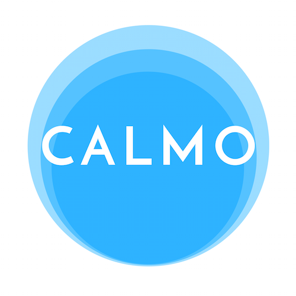

Calmo is a functional app that uses the VR experience to reduce anxiety and pain during procedures. Designed and developed during [NHS Hack Day](http://nhshackday.com/index.html) 2018, Cardiff.

### How to use Calmo

You will need:

* A smartphone
* A viewer (eg: [these viewers](https://vr.google.com/intl/en_uk/cardboard/get-cardboard/))

Then download the Calmo app on your phone for free at the Apple App Store or Google Play Store.

### The Problem

Having blood taken can be an experience filled with anxiety and pain. The thought of this procedure can put people off having this simple procedure, which in turn can potentially lead to a delay or cancellation in treatments, affecting the patient's health outcomes and an inefficient use of clinicians' time.

Studies show between 3.5-10% of people have needle phobia.

The accessibility of VR technology introduces a new avenue of procedural distraction through VR.

### User stories

#### As a user...

* I want to be able to complete a blood collection procedure with minimal pain and anxiety.
* I want to be able to use the app despite language barriers and/or learning difficulties

#### As a clinician...

* I want to be able to easily extract blood from the patient inflicting minimal pain and anxiety.
* I want to extract blood from the patient within an average timeframe of 5mins

### How We Built It

#### The design

* Development of user stories
* Conducting secondary research
* Carrying out user testing & interviews

#### The build

This app was built with:

* [Unity](https://unity3d.com/learn/tutorials/s/virtual-reality)
* The target platform using [Google Cardboard](https://vr.google.com/cardboard/)
* Audio track created in Logic Pro

### Research

#### Distraction

Psychological interventions for needle-related procedural pain and distress in children and adolescents [article](http://www.cochrane.org/CD005179/SYMPT_psychological-interventions-for-needle-related-procedural-pain-and-distress-in-children-and-adolescents)

#### VR and Distraction

Is Virtual Reality Ready for Prime Time in the Medical Space? A Randomized Control Trial of Pediatric Virtual Reality for Acute Procedural Pain Management. [article](https://www.ncbi.nlm.nih.gov/pubmed/29053848)

The efficacy of playing a virtual reality game in modulating pain for children with acute burn injuries: a randomized controlled trial [article](<https://www.ncbi.nlm.nih.gov/pubmed/?term=Das%2C+D.+A.%2C+Grimmer%2C+K.+A.%2C+Sparnon%2C+A.+L.%2C+McRae%2C+S.+E.%2C+%26%C2%A0Thomas%2C+B.+H.+(2005).+The+efficacy+of+playing+a+virtual+reality%C2%A0game+in+modulating+pain+for+children+with+acute+burn%C2%A0injuries>)

Clinical Use of Virtual Reality Distraction System to Reduce Anxiety and Pain in Dental Procedures [article](https://www.ncbi.nlm.nih.gov/pmc/articles/PMC4043252/)

Jeffrey I. Gold, Nicole E. Mahrer; Is Virtual Reality Ready for Prime Time in the Medical Space? A Randomized Control Trial of Pediatric Virtual Reality for Acute Procedural Pain Management, Journal of Pediatric Psychology [article](pdf)

Virtual Reality: A Distraction Intervention for Chemotherapy [article](https://www.ncbi.nlm.nih.gov/pmc/articles/PMC2121303/)

The effectiveness of virtual reality distraction for pain reduction: a systematic review. [article abstract](https://www.ncbi.nlm.nih.gov/pubmed/20691523?dopt=Abstract)

#### Similar apps currently available

[Box breathing app](http://boxbreathing.org/) uses audio prompts and gamification techniques.

[Deep VR](http://www.exploredeep.com/#about-deep) Meditative VR game controlled by breathing

### Considerations

* Translations
* Learning Difficulties
* Infection Control
* Users with impairments such as hearing
* Patients having procedures in a variety of positions (ie: supine, prone, sidelying, sitting)
* Patients who have epilepsy / nausea
* Safety case and testing of the app

### Future Features

* A variety of environments, such as a forest, mountains or a beach setting.
* Scaling for patients of all ages (for example use for paediatrics, adolescents, adults and geriatrics)

<small>Terms and Conditions: This app is beta software and hereunder is still in the testing phase. It is provided on an “as is" and “as available” basis. A primary source of this beta testing is to obtain feedback on software performance and the identification of defects. Users are advised to use caution and not to rely in any way on the correct functioning or performance of the beta software and/or accompanying materials.</small>
